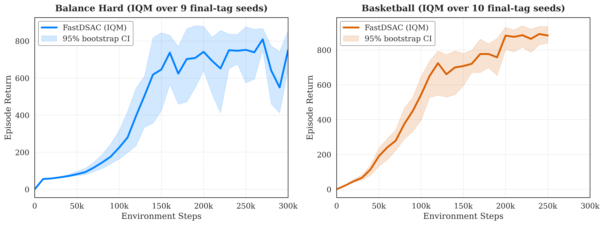
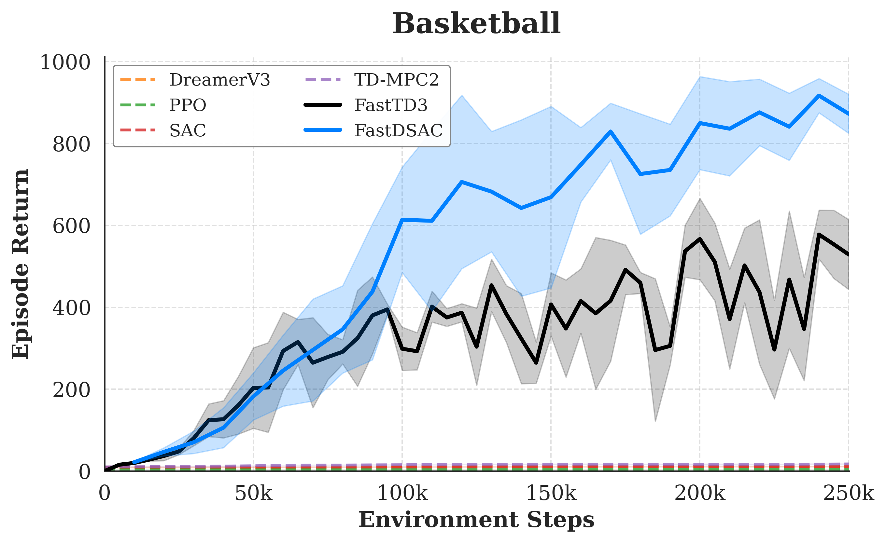
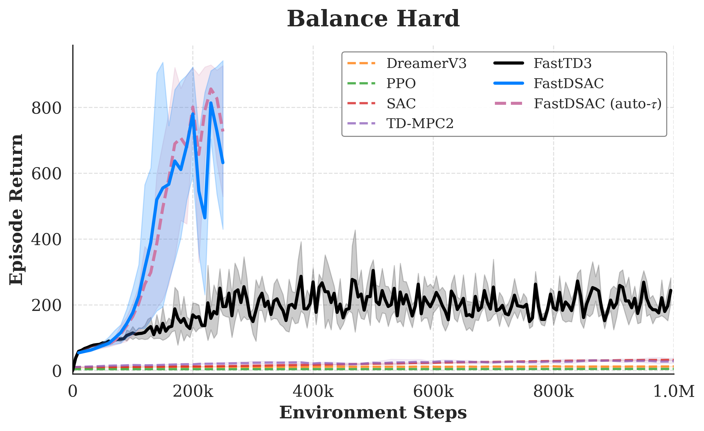

# FastDSAC

[](https://arxiv.org/abs/2603.12612)
[](https://arxiv.org/pdf/2603.12612)
[](https://eit-east-lab.github.io/FastDSAC/)
[](https://github.com/EIT-EAST-Lab/FastDSAC_official)
[](LICENSE)

Official implementation of **FastDSAC: Unlocking the Potential of Maximum Entropy RL in High-Dimensional Humanoid Control**.

FastDSAC scales maximum entropy stochastic reinforcement learning to high-dimensional humanoid control. The method combines **Dimension-wise Entropy Modulation (DEM)** for structured exploration with a **continuous distributional critic** for stable value estimation in large action spaces.

## Highlights

- Stochastic maximum entropy RL for high-dimensional humanoid control.
- DEM reallocates exploration variance across action dimensions instead of applying uniform Gaussian noise.
- A continuous Gaussian distributional critic avoids fixed C51 supports and reduces value-estimation artifacts.
- Evaluated on HumanoidBench, MuJoCo Playground, and IsaacLab.
- Achieves strong returns on difficult HumanoidBench tasks, including Basketball near 900 and Balance Hard near 700.
- Includes released results, paper figures, and demo videos for simulation and real-robot rollouts.

## Key Results

<p align="center">
  
</p>

<p align="center">
  
  
</p>

## Repository Layout

```text
fast_sac/
  fast_sac.py                              # FastDSAC / FastSAC model components
  fast_sac_learned_temperature.py          # Auto-temperature DEM variant
  train_fastdsac_torch_enhanced.py         # Main FastDSAC training entrypoint
  train_fastdsac_torch_enhanced_learned_temperature.py
  train_fastsac_c51dem.py                  # C51 + DEM ablation
  environments/                            # HumanoidBench, MuJoCo Playground, IsaacLab wrappers
  new_runs_data/                           # Released CSV results and generated figures
demo_videos/                               # Real-robot and simulation demos
requirements/                              # Python dependency snapshots
run_training_sequence.sh                   # Representative training commands
```

## Installation

FastDSAC follows the environment and dependency setup of [FastTD3](https://github.com/younggyoseo/FastTD3). Install the simulator stacks and benchmark environments following the FastTD3 instructions first, especially HumanoidBench, MuJoCo Playground, and IsaacLab.

After the FastTD3-style environment is ready:

```bash
git clone https://github.com/EIT-EAST-Lab/FastDSAC_official.git
cd FastDSAC_official
pip install -e .
pip install -r requirements/requirements.txt
```

For MuJoCo Playground tasks, install the additional JAX/CUDA dependencies:

```bash
pip install -r requirements/requirements_playground.txt
```

Notes:

- HumanoidBench is treated as an external benchmark dependency, not vendored in this repository.
- IsaacLab requires its own simulator installation and should be installed according to the IsaacLab/FastTD3 setup.
- We recommend running with a CUDA GPU. The released experiments were designed for high-throughput parallel simulation.

## Running FastDSAC

The main entrypoint is:

```bash
python fast_sac/train_fastdsac_torch_enhanced.py --env_name <ENV_NAME> [options]
```

Representative commands are collected in:

```bash
chmod +x run_training_sequence.sh
bash run_training_sequence.sh
```

### HumanoidBench

```bash
python fast_sac/train_fastdsac_torch_enhanced.py \
  --env_name h1hand-reach-v0 \
  --exp_name FastDSAC_humanoidbench_reach \
  --total_timesteps 200000 \
  --eval_interval 10000 \
  --learning_starts 1000 \
  --alpha_init 0.001 \
  --target_entropy_ratio 0.0 \
  --use_layer_norm \
  --scale_max 2 \
  --scale_min 0.01 \
  --tuned_betas \
  --tau_b 0.005 \
  --tau 0.005 \
  --log_std_max 1.0 \
  --log_std_min -10.0
```

### MuJoCo Playground

```bash
python fast_sac/train_fastdsac_torch_enhanced.py \
  --env_name T1JoystickRoughTerrain \
  --exp_name FastDSAC_playground_t1_rough \
  --total_timesteps 100000 \
  --eval_interval 5000 \
  --learning_starts 1000 \
  --alpha_init 0.01 \
  --target_entropy_ratio 0.0 \
  --no-use_layer_norm \
  --scale_max 2 \
  --scale_min 0.01 \
  --tuned_betas \
  --tau_b 0.005 \
  --tau 0.005 \
  --log_std_max 1.0 \
  --log_std_min -10.0
```

### IsaacLab

```bash
python fast_sac/train_fastdsac_torch_enhanced.py \
  --env_name Isaac-Velocity-Flat-G1-v0 \
  --exp_name FastDSAC_isaaclab_g1_flat \
  --total_timesteps 100000 \
  --eval_interval 5000 \
  --learning_starts 1000 \
  --alpha_init 0.01 \
  --target_entropy_ratio 0.0 \
  --no-use_layer_norm \
  --scale_max 2 \
  --scale_min 0.01 \
  --tuned_betas \
  --tau_b 0.005 \
  --tau 0.005 \
  --log_std_max 1.0 \
  --log_std_min -10.0
```

### Auto-temperature DEM

The auto-temperature DEM variant is implemented in `fast_sac/train_fastdsac_torch_enhanced_learned_temperature.py`. Keep task and training parameters consistent with the corresponding FastDSAC runs when comparing this variant.

## Released Results

We release result tables and plotting outputs under:

```text
fast_sac/new_runs_data/csv_results/
fast_sac/new_runs_data/plots/
```

## Demo Videos

We include demo videos for real-robot Unitree G1 transfer, HumanoidBench comparisons, and MuJoCo Playground rollouts under `demo_videos/`.

## Citation

```bibtex
@article{xue2026fastdsac,
  title   = {FastDSAC: Unlocking the Potential of Maximum Entropy RL in High-Dimensional Humanoid Control},
  author  = {Xue, Jun and Wang, Junze and Wang, Shanze and Zhang, Xinming and Chen, Yanjun and Zhang, Wei},
  journal = {arXiv preprint arXiv:2603.12612},
  year    = {2026},
  doi     = {10.48550/arXiv.2603.12612},
  url     = {https://arxiv.org/abs/2603.12612}
}
```

## Acknowledgements

The environment setup and high-throughput training protocol follow [FastTD3](https://github.com/younggyoseo/FastTD3). We thank the FastTD3 authors and the maintainers of HumanoidBench, MuJoCo Playground, IsaacLab, SAC, TD3, and related open-source reinforcement learning projects.

## License

This project is released under the MIT License. See [LICENSE](LICENSE) for FastDSAC licensing and preserved third-party notices.
